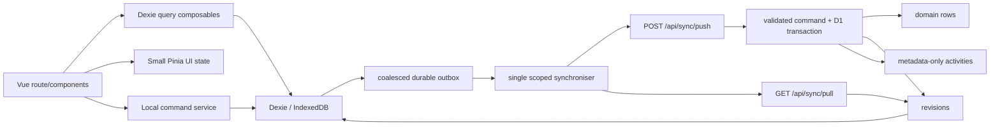

# Local-first offline support, audit trails, and platform refactor

## Purpose

This plan implements [issue #72](https://github.com/remihuigen/pantrypanic/issues/72): a genuinely
local-first Pantry Panic app, durable server-side audit trails, and a staged platform refactor that
remains reviewable at every point.

Every checkpoint ends in a deployable working state, is validated on a new staging environment
before it is eligible for production, and has a human approval gate. The intent is to replace the
current data model deliberately, not to preserve every internal implementation or unused API route.

## Decisions now fixed

| Decision                                                   | Plan consequence                                                                                                                                                                                                                     |
| ---------------------------------------------------------- | ------------------------------------------------------------------------------------------------------------------------------------------------------------------------------------------------------------------------------------ |
| `/app/**` may become SPA-only.                             | Adopt client rendering for the authenticated app, while retaining server API routes and public/marketing rendering as appropriate. Add a global SPA loading template. This removes SSR/deep-link constraints from the PWA app shell. |
| Production compatibility and data migration are not goals. | Internal app routes, stores, APIs, and persisted production data may be replaced. Final rollout deploys to new versioned Worker, D1, and R2 resources; legacy production data is not transferred.                                    |
| Pinia is UI state only.                                    | Pinia does not own or persist entity collections. Dexie is the local data source; query composables expose bounded reactive result sets to components.                                                                               |
| Use Dexie core.                                            | Add `dexie` only (not Dexie Cloud) to the Nuxt app. Use its typed tables, transactions, and live-query integration where appropriate.                                                                                                |
| Reduce database transactions.                              | Coalesce unsent changes for the same record in the durable outbox. Revisions record committed meaningful mutations, not every UI interaction.                                                                                        |
| Server conflict rule.                                      | Server-side last-write-wins in acceptance order; no user conflict dialog or CRDT.                                                                                                                                                    |
| Audit data is metadata only.                               | Never persist record snapshots, request bodies, passwords, tokens, access links, emails, raw IP addresses, or other sensitive values in the audit trail.                                                                             |
| Retention is out of scope.                                 | Keep revisions, activity rows, and receipts indefinitely. Build all access paths to remain indexed, bounded, and cursor-paginated; revisit deletion/archive policy later.                                                            |
| Move to a monorepo.                                        | Create `apps/nuxt` for the current application and a pnpm workspace root, leaving room for future backup and D1↔R2 migration workers. Those workers are explicitly outside this plan.                                                |
| Staging precedes feature work.                             | Stop automatic deploys from `main`. Deploy manually to `staging` or `production` through a selected GitHub Environment, each with isolated Cloudflare resources and secrets.                                                         |
| Feature flags use environment variables.                   | No database/admin flag system. Flags are explicit `NUXT_*` environment variables parsed once in runtime configuration.                                                                                                               |

## Goals and boundaries

### Target behaviour

For a supported household data family, a user can open a previously used `/app` installation
offline, immediately query the last synchronised data, make changes, reload without losing them, and
later reconnect without duplicate writes. The UI shows accurate local/pending/synchronising/error
state.

The server remains authoritative for authentication, permissions, validation, household membership,
and final write order. Dexie is authoritative for durable local data on one browser/device.

### Initial and deferred product scope

The first local-first slice is the actual shopping-list usage path: list overview/detail, manual
item add/edit/check/uncheck/delete, list archive/delete, and list/item reordering. It proves stable
client IDs, local durability, outbox coalescing, tombstones, aliases, ordering, and two-device
convergence.

Then migrate categories/canonical items and recipes/recipe items by validated vertical slice. The
meal planner has no established current usage pattern, so do **not** redesign or migrate it into a
new store early: leave it on its current implementation until product usage/research defines the
desired model.

Authentication, registration, password/profile security changes, avatar/blob uploads, household
membership/ownership, invitations, account deletion, and destructive household actions remain
online-only. They are nevertheless activity-audited.

### Non-goals

- No CRDT, WebSocket, or real-time collaboration system.
- No Workbox interception that queues arbitrary authenticated requests.
- No implementation of backup or D1↔R2 migration workers; only their future workspace location is
  prepared.
- No retention, pruning, deletion, or R2 archival system in this programme.
- No database snapshots, request payloads, or sensitive data in audit rows.
- No need to keep unused app APIs or the current large Pinia stores alive after their usage
  inventory has been reviewed.
- No production-data migration, data-preservation guarantee, compatibility layer, export/import
  rehearsal, or rollback-to-old-data procedure. The legacy production environment remains separate
  and untouched by the new deployment.

## Research and current-state findings

### Issue requirements incorporated

The issue and comments require local-first behaviour, hidden conflict handling, client-generated
IDs, a separate revision and activity audit model, and a Settings audit view with search/filter. The
comments also correctly identify D1 access patterns—not raw row count—as the primary
performance/cost concern.

### Repository observations

| Area       | Current state                                                                                                                               | Required change                                                                                                                  |
| ---------- | ------------------------------------------------------------------------------------------------------------------------------------------- | -------------------------------------------------------------------------------------------------------------------------------- |
| State      | `lists`, `recipes`, and `meal-planner` Pinia stores hold normalized entity maps/arrays and persist them with `pinia-plugin-persistedstate`. | Inventory actual component use, delete/rebuild the stores around UI-only state, and move entity persistence/querying into Dexie. |
| Sync       | `useStoreRefresh.ts` polls the active route roughly every five seconds.                                                                     | Replace route snapshot polling with cursor-based pull once a family is migrated; remove it after cutover.                        |
| PWA        | `/app/**` is controlled by a Workbox worker but excluded from navigation fallback to preserve SSR.                                          | SPA-only `/app` enables a cacheable non-user-specific shell and predictable offline deep links.                                  |
| Server     | Zod boundary validation, folder-based API routes, NuxtHub/Drizzle, D1 production, R2 blobs.                                                 | Add a focused sync command layer; remove unused routes only after an evidence-based route inventory.                             |
| Deployment | `.github/workflows/deploy.yml` deploys from `main` and uses only the `production` GitHub Environment.                                       | Add staging resources/secrets and a manual target-environment workflow; no push-based production deployment.                     |

### External research and conclusions

- Dexie provides typed IndexedDB tables, bulk operations, and explicit multi-table transactions. Use
  transactions for local entity/outbox/state changes together; do not await unrelated network work
  inside a Dexie transaction.
  [Dexie transactions](https://dexie.org/docs/Dexie/Dexie.transaction%28%29) and
  [Dexie tables](https://dexie.org/docs/Table/Table).
- Workbox Background Sync only queues failed fetches by default and does not solve application-level
  ordering, session scope, or semantic 4xx/5xx failures. It is not the outbox correctness mechanism.
  [Workbox Background Sync](https://developer.chrome.com/docs/workbox/reference/workbox-background-sync).
- Nuxt supports `ssr: false` route rules and a `spaLoadingTemplate`; Nuxt 4 uses
  `~/spa-loading-template.html` for the loading markup.
  [Nuxt SPA loading template](https://nuxt.com/docs/api/configuration/nuxt-config) and
  [Nuxt 4 upgrade guidance](https://nuxt.com/docs/4.x/getting-started/upgrade/).
- Cloudflare environments need separate non-inheritable bindings and variables. Staging must use its
  own Worker, D1 database, R2 bucket, site URL, and session secret; it must never point to legacy
  production data.
  [Cloudflare Workers environments](https://developers.cloudflare.com/workers/wrangler/environments/)
  and [D1 environments](https://developers.cloudflare.com/d1/configuration/environments/).
- GitHub Actions supports a manually selected `environment` input, which can bind the deployment job
  to the corresponding protected Environment.
  [GitHub Actions workflow-dispatch inputs](https://docs.github.com/en/actions/reference/workflows-and-actions/workflow-syntax).
- D1 charges by rows read/written. Every revision/activity query must be household-scoped, indexed,
  cursor-paginated, and limited; keep the history forever for now, but never scan it globally.
  [Cloudflare D1 pricing](https://developers.cloudflare.com/d1/platform/pricing/).

## Architecture



### Monorepo layout

```text
.
├── apps/
│   └── nuxt/                 # current Nuxt app, moved intact first
│       ├── app/ server/ shared/ tests/ layer/
│       ├── nuxt.config.ts
│       └── package.json       # @pantrypanic/nuxt
├── packages/                  # empty until shared code is genuinely needed
├── workers/                   # reserved; no worker implementation in this plan
├── pnpm-workspace.yaml        # apps/*, packages/*, workers/*
├── package.json               # root orchestration scripts only
└── pnpm-lock.yaml             # one workspace lockfile
```

Move the current app first; do not simultaneously extract shared packages. Root scripts delegate
with `pnpm --filter @pantrypanic/nuxt ...`; CI uses the same filtered commands. Keep dependency
versions in the existing catalog/workspace arrangement and add Dexie to `apps/nuxt` only. Adjust all
paths in Nuxt config, tests, deployment output, docs, git hooks, and workflows as part of the move.

### Cloudflare infrastructure scaffold

Checkpoint `-1` adds a small workspace package that provisions the Cloudflare resources used by the
Nuxt application before any deployment workflow attempts to consume them:

```text
infra/
├── package.json             # @pantrypanic/infra; contains tsx and Zod
├── constants.ts             # approved names, environment/resource definitions, API paths
├── scaffold.ts              # idempotent `scaffoldInfrastructure` CLI entry point
├── schema.ts                # Zod schemas for process input, CLI options, env files, CF responses
├── .staging.env             # generated, untracked resource configuration
└── .production.env          # generated, untracked resource configuration
```

`infra` is a pnpm workspace member. It uses Node's built-in `fetch`, `tsx`, and Zod—not a Cloudflare
SDK—and exposes a root wrapper such as `pnpm infra:scaffold -- --environment staging`. The only
required process inputs are:

```text
CLOUDFLARE_ACCOUNT_ID
CLOUDFLARE_API_TOKEN
```

The command requires `--environment staging|production`; support `--dry-run` from the first version.
`schema.ts` parses process input at the boundary and validates the relevant Cloudflare API
envelopes. Errors identify the failing resource/operation but never echo the API token or response
bodies containing credentials.

`constants.ts` defines exactly one approved, versioned name set, for example
`pantrypanic-staging-v2`/`pantrypanic-v2` for the Worker, D1 database, and R2 bucket. These names
must be new and must not resolve to legacy production resources. Resource placement is intentionally
unspecified unless the operator passes `--jurisdiction eu|fedramp`; this makes an EU restriction an
explicit deployment decision rather than a hidden default.

For the selected environment, `scaffold.ts` performs this sequence:

1. validate account/token and CLI input;
2. list/find the exact named D1 database and R2 bucket; create only a missing resource;
3. record the named Worker service for deployment, but do not upload placeholder app code, configure
   routes, or set secrets—the first environment-specific `wrangler deploy` creates and uploads the
   generated Nuxt Worker;
4. re-read/validate every resource, then atomically write the target `infra/.<environment>.env`
   file;
5. print a redacted summary of adopted/created resources and the next deployment command.

The D1 and R2 calls use Cloudflare's account APIs (`POST /accounts/{account_id}/d1/database` and
`POST /accounts/{account_id}/r2/buckets`) and are idempotent by exact-name lookup. A Worker script
requires a code upload, so the scaffold deliberately leaves its creation to the first
source-controlled `wrangler deploy` rather than publishing an unsafe placeholder. The approved names
are the isolation control: if any resolves to a legacy resource, stop and correct the name; never
adopt or write to that resource. A partial failed run is safe to run again because the final env
file is written only after all new resources have been confirmed.

The generated files contain resource configuration only:

```dotenv
CLOUDFLARE_ACCOUNT_ID=...
CLOUDFLARE_WORKER_NAME=pantrypanic-staging
CLOUDFLARE_D1_DATABASE_ID=...
CLOUDFLARE_R2_BUCKET=pantrypanic-staging
CLOUDFLARE_ENV=staging
```

They never contain `CLOUDFLARE_API_TOKEN`, session/admin credentials, Turnstile secrets, or GitHub
credentials. Add both generated paths to `.gitignore` despite the absence of tokens; configuration
IDs and environment topology should not be committed by default. `NUXT_PUBLIC_SITE_URL` and
application secrets remain explicit GitHub Environment configuration because the scaffold neither
configures DNS/custom domains nor GitHub.

The current workflow's `CLOUDFLARE_CACHE_NAMESPACE_ID` is not read by `nuxt.config.ts`; it is not
scaffolded. Remove that stale secret/input after confirming no deployment/runtime contract depends
on it. GitHub Environment/secret creation is explicitly deferred to a later infrastructure scope.

### SPA `/app` route model

- Set `routeRules` to `ssr: false` for `/app` and `/app/**`; public/auth/marketing routes keep their
  deliberately chosen rendering behavior.
- Add `apps/nuxt/spa-loading-template.html`, branded but dependency-free, and configure
  `spaLoadingTemplate`/loader attributes in Nuxt. It must be accessible, avoid user data, and render
  before Vue hydration.
- PWA caches the SPA shell and immutable build assets only. It does not cache authenticated
  `/api/**` responses; Dexie stores household data and enforces user/household scope.
- Validate direct deep links, initial authenticated loading, redirects, PWA install/update, and
  offline cold launch on staging. If an app route depends on SSR-only behavior, refactor it during
  this checkpoint rather than retaining partial SSR support.

### Pinia, Dexie, and UI boundaries

Pinia contains only small UI/session-adjacent state: selected item/list ID, open drawer/modal state,
active filters/sort values, route-scoped loading state, sync indicator state, and ephemeral form
state when a component does not own it. It contains no `ById` maps, no server entity arrays, no
item-vault catalog, no activity list, no audit pages, and no persisted domain state.

Dexie owns durable entities, tombstones, sync cursor, aliases, and the outbox. Query composables
issue bounded indexed queries and return only the records a current view needs:

| Feature              | Data access pattern                                                                                 |
| -------------------- | --------------------------------------------------------------------------------------------------- |
| List overview/detail | `useListsQuery()` and `useListDetailQuery(listId)` query Dexie and expose read-only results.        |
| Item vault           | `useItemVaultQuery(filters, cursor)` reads paged records from Dexie directly; no Pinia cache.       |
| Activity log         | `useActivityLogQuery(filters, cursor)` reads cursor-paged rows directly from Dexie; no Pinia cache. |
| Sync indicator       | `useSyncController()` exposes minimal reactive status and actions; it does not duplicate entities.  |

Route components remain composition surfaces. Feature components receive typed props and emit typed
events; commands live in focused composables/services. This is an opportunity to delete the bloated
`lists`, `recipes`, and `settings` store designs after usage analysis rather than preserve their
public action signatures. Leave the meal-planner store unchanged until its usage model is known.

### Dexie schema and scope

Create one client-only database, for example `pantrypanic-v2`, using Dexie core:

| Table       | Keys/indexes                                                                  | Contents                                                                                   |
| ----------- | ----------------------------------------------------------------------------- | ------------------------------------------------------------------------------------------ |
| `entities`  | `[scope+entityType+id]`, `[scope+entityType]`, `[scope+entityType+updatedAt]` | Sanitized domain documents and tombstones.                                                 |
| `mutations` | `mutationId`, `[scope+status+sequence]`, `[scope+entityType+entityId]`        | Coalescible durable commands, dependency/order metadata, retry state, and safe error code. |
| `syncState` | `scope`                                                                       | Device ID, protocol version, cursor, bootstrap state, and sync timestamps.                 |
| `aliases`   | `[scope+entityType+clientId]`                                                 | Client-to-canonical server ID mappings.                                                    |
| `activity`  | `[scope+occurredAt+id]`, `[scope+operation+occurredAt]`                       | Locally cached, metadata-only audit pages.                                                 |

`scope` combines authenticated user ID and active household ID. No query runs until that scope is
resolved. On logout, household switch, or user change, stop synchronisation, clear Vue/Pinia UI
state, close the old Dexie context, and never replay its mutations. The persisted old scope may
remain encrypted-by-browser storage policy or be cleared according to the selected logout UX, but it
is never accessible under a new scope.

### Sync and coalescing protocol

New, versioned routes under `server/api/sync/`:

| Route                               | Responsibility                                                                          |
| ----------------------------------- | --------------------------------------------------------------------------------------- |
| `POST /api/sync/bootstrap`          | Full current household snapshot plus a cursor captured before snapshot read.            |
| `POST /api/sync/push`               | Applies bounded, idempotent, coalesced commands for the authenticated active household. |
| `GET /api/sync/pull?cursor=&limit=` | Returns ascending revisions after a cursor, with bounded pagination.                    |
| `GET /api/settings/activity`        | Owner-authorized, metadata-only activity pages, filterable and cursor-paginated.        |

The local command service applies the visible state and updates/creates its outbox record in one
Dexie transaction. It immediately returns success to the UI once that transaction commits. A single
synchroniser per scope runs at hydration, reconnect, foreground, explicit retry, and after local
commands.

#### Required coalescing rules

Coalescing happens only while a mutation is pending and has not entered an active push batch. It
reduces both D1 writes and revision/activity noise without losing the final local state.

| Sequence for one record                                                          | Durable outbox result                                                                                |
| -------------------------------------------------------------------------------- | ---------------------------------------------------------------------------------------------------- |
| Create → one or more field edits                                                 | One create command with final field values.                                                          |
| Update → update                                                                  | One merged patch containing the final values.                                                        |
| Check → uncheck, or repeated scalar edits                                        | One final status/patch command.                                                                      |
| Create → delete before any push                                                  | Remove the local created entity and its outbox command; no server transaction or revision is needed. |
| Reorder repeatedly for one list                                                  | One latest complete ordered-set command per list.                                                    |
| A command already being pushed                                                   | Immutable; subsequent interactions create a new pending command.                                     |
| Commands with distinct server-side side effects (`clear`, recipe-to-list, merge) | Never coalesce unless their domain semantics are explicitly proven equivalent.                       |

Use a short debounced push after an edit plus a finite maximum delay; offline/reload safety comes
from the immediate Dexie transaction, not the debounce. The protocol carries client-generated UUIDs
and a `protocolVersion`. The server stores idempotency receipts so a dropped response can safely be
replayed.

### Server commands, revisions, and activity

The server validates every command with shared strict Zod discriminated unions. It resolves the
authenticated household, checks the receipt, applies the domain write(s), receipt, revision(s), and
activity row in one proven D1 atomic operation. Before use, run an atomicity spike against local
SQLite and **staging D1**; if the high-level Drizzle transaction is unsuitable, use a server-only
supported D1 batch/transaction helper.

| Table            | Minimum data                                                                                                                                                                                                                                       |
| ---------------- | -------------------------------------------------------------------------------------------------------------------------------------------------------------------------------------------------------------------------------------------------- |
| `revisions`      | Integer monotonic sequence, UUID, household ID, mutation ID, entity type/ID, `upsert`/`delete`, complete sanitized post-commit sync document or tombstone, actor user ID, timestamp.                                                               |
| `activities`     | UUID, timestamp, optional household/actor IDs, request ID, typed operation, outcome, target type/ID, and allow-listed non-sensitive metadata. No payload/document, raw IP, user agent, email, token, password, access-link value, or request body. |
| `sync_mutations` | Household ID, actor user ID, mutation UUID, device ID, status, timestamp, request ID; unique `(household_id, actor_user_id, mutation_id)`.                                                                                                         |

Required indexes: revisions by `(household_id, sequence)`,
`(household_id, entity_type, entity_id, sequence)`, and `(household_id, mutation_id)`; activities by
`(household_id, occurred_at DESC, id DESC)`, `(actor_user_id, occurred_at DESC, id DESC)`, and
`(household_id, operation, occurred_at DESC, id DESC)`; receipt uniqueness as above.

A revision is written only for a server-committed command after local coalescing. It is not a trace
of keystrokes, toggles that were reversed before sync, or transient UI state. A bulk command emits
final revisions/tombstones for every affected sync entity so a device can reconstruct the
materialized state.

Activity operation names are an allow-listed vocabulary such as `auth.login.succeeded`,
`auth.login.failed`, `household.member_removed`, `list.created`, `list_item.checked`, and
`sync.mutation_rejected`. Failed login audit entries use neither an email nor an IP. This meets the
security/audit value without recording sensitive data.

### Conflict and deletion rules

The server acceptance sequence is the conflict resolver:

- independent records both apply;
- concurrent scalar edits: the later accepted command wins;
- delete/update: acceptance order wins; deletes are tombstones;
- reorder: the later accepted full order wins;
- duplicate replay: receipt returns the prior result without new data/revision/activity;
- canonical-item name collision: server selects the existing canonical item and returns an alias
  mapping;
- invalid commands (for example, references to a remote-deleted entity) resolve to authoritative
  server state and a safe local error/sync status, not a merge dialog.

Schema migrations apply only to the new, versioned D1 database. They can freely reshape the app
model because no legacy production rows are copied or interpreted. Keep normal migration tests for
the new environment, but do not build a production-data export/import, preservation, or
compatibility programme.

### API inventory and removal

Before removing any route, build an inventory from application imports/calls, server route tests,
docs, GitHub workflows/scripts, and production/staging request logs. Classify each as app-required,
deployment/admin-required, future-worker contract, or unused.

Remove an unused route only after its callers/tests/docs are removed in the same checkpoint and
staging has run without it. Keep required admin/deployment endpoints even if the Vue app does not
call them. Sync routes replace migrated app data routes; there is no obligation to retain their
legacy equivalents once the inventory proves they are unused.

## Delivery checkpoints and human validation

All checkpoints run `pnpm lint`, `pnpm typecheck`, relevant `pnpm test:run`, and `pnpm build` for
Nuxt/runtime/config work. Every deploy is manually run against **staging** first. Production deploy
is a separate manual dispatch of the same tested commit, after the human approval gate.

### Checkpoint -1 — pnpm monorepo and staging delivery pipeline

**Goal:** create the safe delivery foundation before product refactoring.

**Implementation:**

- Move the Nuxt project to `apps/nuxt` without changing its runtime behavior; create
  `pnpm-workspace.yaml`, root orchestration `package.json`, and filtered scripts.
- Add the `infra` pnpm workspace package (`tsx` + Zod) and `scaffoldInfrastructure` command. It
  reads only `CLOUDFLARE_ACCOUNT_ID` and `CLOUDFLARE_API_TOKEN`, idempotently provisions/adopts the
  selected environment's D1 database and R2 bucket, records the Worker name for first deploy, and
  writes `infra/.staging.env` or `infra/.production.env` without secrets.
- Add schema/unit tests with mocked Cloudflare API responses for create, reuse, dry-run, malformed
  response, mismatched-resource, and partial-failure/re-run behavior. Add the generated files to
  `.gitignore`; do not create GitHub Environments or secrets from this script.
- Update all relative paths, NuxtHub migration discovery, generated Worker output paths,
  lint/typecheck/test/build scripts, docs, `.agents/`, git hooks, and GitHub Actions.
- Create separate, versioned Cloudflare staging and replacement-production Workers, D1 databases,
  and R2 buckets, site URLs, and session secrets. Verify none of their identifiers reference the
  legacy production environment. Configure GitHub `staging` and `production` Environments with those
  new, separate secrets/variables.
- Change deployment to `workflow_dispatch` only, with a required environment input (`staging` or
  `production`). Bind the job to `${{ inputs.environment }}`; select its resources only from that
  GitHub Environment. Remove the `push: main` deployment trigger.
- Build, apply migrations, deploy, and seed against the selected environment. Make Worker
  names/environment-specific Nuxt config values explicit, rather than relying on inherited
  Cloudflare bindings.
- Remove the unused `CLOUDFLARE_CACHE_NAMESPACE_ID` workflow secret/input after the
  infrastructure/config audit confirms it has no consumer.
- Add a deployment provenance check: record commit SHA, target environment, Worker name, D1 database
  ID fingerprint, and app URL in the workflow summary. Production must require GitHub Environment
  approval.

**Working app state:** current functionality is unchanged, but the app runs from `apps/nuxt`;
staging and replacement production are manually deployable and physically isolated from legacy
production resources.

**Human master validates:** the scaffold can safely run twice without creating duplicates; generated
env files contain only expected resource identifiers; staging and replacement-production identifiers
are new and distinct from legacy production; production no longer auto-deploys from `main`; and
commands/workflows work from the new workspace paths.

### Checkpoint 0 — SPA app shell, usage inventory, and runtime flags

**Goal:** remove SSR as an `/app` constraint and establish the actual refactor scope.

**Implementation:**

- Set `/app` and `/app/**` to client rendering; add the global SPA loading template and test
  direct/open/offline app routes on staging.
- Confirm the PWA shell works offline after one online visit without caching authenticated API
  responses.
- Inventory every component/store/action/API route by actual app usage. Identify the smallest store
  replacement for lists, recipes, settings, and item vault; mark meal planner as deferred.
- Inventory routes for future removal, but do not remove them yet.
- Replace scattered feature decisions with one environment-derived flag module. Initial flags
  include `NUXT_PUBLIC_OFFLINE_SYNC_ENABLED`, `NUXT_PUBLIC_OFFLINE_SYNC_LISTS_ENABLED`, and private
  matching `ENABLE_OFFLINE_SYNC*` guards. Public flags only enable UI/protocol paths; server
  authorization remains mandatory.
- Record the approved new production resource identifiers and confirm the clean-environment rollout
  deliberately has no legacy data transfer.

**Working app state:** `/app` is an SPA with a loading screen; existing functionality remains
available, and all new feature flags are disabled by environment.

**Human master validates:** SPA deep links/auth redirects/PWA shell work on staging, the usage and
route inventory is credible, and flags are sourced only from environment configuration.

### Checkpoint 1 — audit/revision schema and new-environment atomicity

**Goal:** prove durable server primitives on the new database before offline writes.

**Implementation:**

- Add additive Drizzle schema/migrations for revisions, activities, and receipts with the indexes
  above.
- Add shared operation vocabulary, strict sync schemas, request ID helpers, and metadata
  allow-list/redaction tests.
- Prove domain write + receipt + revision + activity all commit or all roll back in a staging-D1
  atomicity test.
- Verify a clean database can apply all schema migrations, seed the initial admin, and support the
  new audit/sync tables with the required indexes.
- Do not add retention work, R2 archive code, or IP/user-agent collection.

**Working app state:** the replacement environment can initialize cleanly; new audit/sync tables and
migrations are production-ready but do not yet power the UI.

**Human master validates:** clean-database initialization output, schema/indexes, atomicity
evidence, and proof that audit data contains only allowed metadata.

### Checkpoint 2 — audit activity slice and API pruning preparation

**Goal:** deliver a useful audit page while proving server history reads are bounded.

**Implementation:**

- Add paginated `/api/activity` and owner authorization. Filter by date, operation, actor ID, target
  type/ID, using only indexed cursor access.
- Emit metadata-only activity rows for auth, household, and a small set of list operations. Capture
  no payload or sensitive identifiers beyond the authorized actor/target IDs.
- Add the Settings activity route/components. `useActivityLogQuery()` stores and reads activity
  pages directly in Dexie; Pinia only holds current filter/drawer UI state.
- Add `GET /api/sync/pull` with strict cursor/limit validation and bounded revision queries.
- Use the completed route inventory to delete only proven unused application routes, their client
  callers, tests, and documentation.

**Working app state:** owners can search/filter a safe activity history; the rest of the app remains
current behavior. Deleted routes have no callers and are verified absent on staging.

**Human master validates:** audit filters/authorization, no sensitive value in database/API/UI, D1
query bounds, and each proposed route deletion.

### Checkpoint 3 — Dexie foundation and store redesign (read-only lists)

**Goal:** replace entity-heavy Pinia state with direct Dexie queries before enabling local writes.

**Implementation:**

- Add Dexie core to `apps/nuxt`; define schema upgrades, scope isolation, aliases, bootstrap state,
  and test helpers.
- Implement `POST /api/sync/bootstrap`, then hydrate list data into Dexie and pull revisions to the
  captured cursor.
- Rebuild list pages around `useListsQuery()` and `useListDetailQuery()`. Replace/remove the current
  list store’s persisted entity maps. Keep only explicitly justified UI state in a small store or
  local component state.
- Remove Pinia persisted entity state for converted features; import old localStorage state only as
  an untrusted transitional cache, then replace it from bootstrap. It never creates commands or
  overrides server data.
- Implement the sync status controller read-only: bootstrap, offline cached state, pull, retry,
  scope reset.

**Working app state:** list overview/detail render directly from Dexie and can reload offline after
one successful online bootstrap; edits still use the existing online path. Item vault/activity are
not loaded into Pinia.

**Human master validates:** a reload offline renders the last list state, a different user/household
cannot view old scope data, list UI behavior is preserved or intentionally improved, and Pinia no
longer carries list entities.

### Checkpoint 4 — local-first shopping-list commands with coalescing

**Goal:** deliver the first offline mutation path and validate cost-conscious revisions.

**Implementation:**

- Implement sync push command handlers for lists and list items, client IDs, aliases, idempotency
  receipts, tombstones, and complete final revision documents.
- Replace direct list mutation APIs with local command service calls. Components use the same
  feature-level command interface; no new large store is introduced.
- Implement and test the coalescing table rules. Confirm a burst of changes produces one final
  outbound command/revision/activity per record where semantics allow.
- Migrate list reorder to one complete ordered-set command; treat clear/merge-style side effects as
  non-coalescible until proven.
- Enable only the list sync flags in staging. Remove legacy list routes only after inventory
  evidence shows the migrated SPA no longer uses them.

**Working app state:** enabled staging users can create, edit, check, reorder, archive, and delete
supported list data offline; reload; reconnect; and converge without duplicate records or a conflict
dialog.

**Human master validates:**

1. Offline mutation + hard reload + reconnect applies exactly once.
2. Two browsers concurrently edit/delete/reorder and converge to server last-write-wins state.
3. A response-loss replay does not duplicate data/audit/revision rows.
4. A burst of field/status changes yields the expected minimal mutation/revision count.
5. Logout/user/household switching cannot replay or display another scope’s data.

### Checkpoint 5 — complete audit coverage and list cutover

**Goal:** make the audit foundation complete enough for production and remove list-era dead code.

**Implementation:**

- Route auth, user/profile, household, access-link, and list operations through the activity helper;
  add success/failure events where safe.
- Ensure app-originated list writes go only through commands; retire list polling and remove
  proven-unused legacy list APIs, temporary-ID logic, and entity-heavy store code.
- Add metrics/logging for command count, coalescing ratio, duplicate receipt rate, rejected command
  rate, cursor lag, rows read/written, and bootstrap time. Do not log user payloads.
- Update `docs/` and `.agents/` together with architecture, deployment, clean-environment rollout
  runbook, audit vocabulary, and test procedures.

**Working app state:** shopping lists are local-first in staging and eligible for production; audit
activity covers specified security/household/list operations; no old list data store/polling path
remains.

**Human master validates:** clean-environment resource isolation, audit samples, staged deployment
evidence, cost/metrics, and the exact production rollout commit.

### Checkpoint 6 — additional proven data families

**Goal:** migrate one actual usage family at a time; do not begin with meal planner.

For each family—categories/canonical items, then recipes/recipe items—repeat: UI usage review; small
direct-Dexie query composables; command union; coalescing rules; revision/activity semantics;
staging offline/reload/two-device tests; route inventory and removal; human validation; production
release.

Canonical item merge/delete and recipe-to-list remain non-coalescible server-side effects unless an
equivalent final-state command is formally defined. The meal planner remains on its existing
implementation until a separate discovery phase identifies its UX and data ownership requirements.

**Working app state:** each completed family is local-first; incomplete/deferred families remain
usable, with no half-migrated store or route.

**Human master validates per family:** usage model, destructive-operation semantics,
offline/reload/two-device evidence, mutation coalescing expectations, and staging-to-production
release.

### Checkpoint 7 — programme cutover and future-worker handoff

**Goal:** finish the agreed refactor and cut over to the replacement environment without adding
retention/worker scope.

**Implementation:**

- Remove full route polling and legacy app data APIs only after all agreed active data families are
  migrated and used successfully in production.
- Remove the old Pinia persisted-state dependency/configuration if no remaining UI-only use needs
  it.
- Preserve indefinitely growing revisions/activity/receipts with indexed access and monitoring.
  Explicitly defer retention and archival decisions.
- Create only documentation/placeholders for future `workers/backup` and `workers/data-migration`;
  do not build or deploy them.
- Finalize mirrored human/agent docs, clean-environment rollout runbook, deployment policy, and
  feature flag removal plan.

**Working app state:** chosen active app workflows are local-first, Pinia is UI-only, audit is safe
and queryable, deployments are manual/staged, and the repository is ready for future workers without
expanding this scope.

**Human master validates:** replacement resource isolation, production behavior/cost, confirmed
removal list, and explicit acknowledgement that retention/backups are separate future projects.

## Verification matrix

| Scenario                 | Required evidence                                                                                                                                           |
| ------------------------ | ----------------------------------------------------------------------------------------------------------------------------------------------------------- |
| Workspace move           | Root and filtered commands run; app build/deploy paths are correct.                                                                                         |
| Infrastructure scaffold  | Dry-run creates nothing; first run creates/adopts only approved resources; second run is idempotent; generated target env file is complete and secret-free. |
| Environment isolation    | Staging and replacement-production Worker/D1/R2/secrets are distinct and neither references a legacy production resource.                                   |
| Manual deployment        | No push auto-deploy; staging then production deployment uses the same commit and selected GitHub Environment.                                               |
| SPA shell                | `/app` direct routes, auth redirects, PWA update, and offline cold launch work on staging.                                                                  |
| Clean production rollout | Versioned replacement Worker/D1/R2 identifiers are new, the new database initializes successfully, and no legacy data is transferred.                       |
| Dexie scope              | User/household switch and logout never reveal/replay another scope.                                                                                         |
| Offline durability       | Mutate, disconnect, hard reload, reconnect; final command applies once.                                                                                     |
| Coalescing               | Repeated edits to one record emit only the documented final command/revision; side-effect commands remain distinct.                                         |
| Convergence              | Two devices settle on identical server-ordered state.                                                                                                       |
| Audit safety             | Row/API/UI inspection proves no payloads, secrets, email, raw IP, or user agent; authorization is correct.                                                  |
| D1 boundedness           | Query review and metrics prove indexed, household-scoped, limited activity/revision access.                                                                 |

## Risks and controls

| Risk                                                       | Control                                                                                                                                          |
| ---------------------------------------------------------- | ------------------------------------------------------------------------------------------------------------------------------------------------ |
| Monorepo move breaks build/deployment.                     | Deliver it alone at checkpoint -1; staging validates output paths, migrations, and Worker configuration before feature work.                     |
| Scaffold creates or adopts the wrong Cloudflare resource.  | Exact approved names, account/jurisdiction validation, dry-run, no deletion, atomic final env-file write, and idempotency/mismatch tests.        |
| API token leaks into a file or log.                        | Read it only from process environment; Zod/error handling redacts input; generated env files intentionally omit it and are ignored by Git.       |
| New deployment writes to legacy production.                | Use new versioned Worker, D1, and R2 names; verify generated identifiers before deploy; do not configure legacy bindings in GitHub Environments. |
| SPA conversion breaks initial app loading.                 | Stage it separately; test deep links/auth redirects/PWA before data refactor.                                                                    |
| Clean rollout is mistaken for a data-preserving migration. | Explicitly document the reset, isolate the legacy resources, and require human confirmation before replacement-production deployment.            |
| Dexie recreates a giant global store.                      | Direct bounded query composables; Pinia policy forbids entity collections, item-vault, and activity-log caches.                                  |
| Coalescing changes meaning.                                | Restrict it to same-record final-state operations; never coalesce known side effects; test command/revision counts.                              |
| Audit data becomes sensitive.                              | Typed allow-list, deny-list tests, metadata-only API serializers, and no network identity/body fields.                                           |
| Infinite history raises cost.                              | Indexed/cursor-bounded queries and metrics now; retention is a future intentional project, not hidden scope.                                     |

## Definition of done

The agreed active data families are local-first only when all checkpoints have passed their human
gates and:

- replacement production uses new versioned Worker, D1, and R2 resources, is seeded as a clean
  environment, and has no legacy production data transfer;
- staging and replacement production are isolated, manually selected deployment environments;
- the Cloudflare scaffold has idempotently provisioned/adopted each environment's required resource
  identifiers without writing credentials; GitHub resource/secrets scaffolding remains explicitly
  out of scope;
- `pnpm lint`, `pnpm typecheck`, relevant `pnpm test:run`, and `pnpm build` pass from the workspace;
- `/app` SPA loading/PWA offline behavior is verified on staging and production;
- Pinia contains only small UI state; Dexie directly serves entity, item-vault, and activity
  queries;
- outbox coalescing and server last-write-wins behavior pass the verification matrix;
- audit records are metadata-only and all revision/activity paths are indexed and bounded;
- human docs in `docs/` and agent docs in `.agents/` are updated together.
