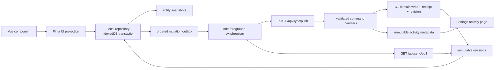

# Local-first offline support and audit trails

## Purpose

This is the implementation plan for [issue #72](https://github.com/remihuigen/pantrypanic/issues/72): make the authenticated product app genuinely usable offline, replace polling-as-the-primary-data-model with local-first synchronisation, and introduce durable audit trails.

The plan deliberately avoids a single cross-cutting rewrite. Every numbered delivery checkpoint below ends in a deployable, usable application state, retains the existing API routes and response envelopes, and has an explicit human approval gate before the next slice starts.

## Outcome and boundaries

### Target outcome

For supported household data, a user can:

- open a previously used `/app` installation without a network connection;
- view the last synchronised household state immediately;
- create and edit supported data while offline, including after a page reload;
- see a small, truthful pending/offline status indicator;
- reconnect and have changes synchronised exactly once, without a conflict-resolution dialog;
- inspect a searchable, filtered household activity log in Settings.

The server remains authoritative for validation, permissions, household membership, and final ordering. Local state is authoritative for responsiveness and durability on a particular device.

### Initial scope

The first offline vertical slice is shopping lists and manual list-item operations: create/edit/archive/delete a list; add/edit/check/uncheck/delete an item; and list/item reordering. This is the highest-frequency workflow and exercises client-generated IDs, tombstones, ordering, optimistic local state, retries, and cross-device changes.

Subsequent slices cover categories/canonical items, recipes and recipe items, then the meal planner. Each is independently releasable. Auth, registration, password changes, avatar/blob uploads, household membership/ownership, invitation links, account deletion, and destructive household actions remain online-only in this programme. They are still included in the activity audit trail.

### Explicit non-goals for the first release

- No CRDT, WebSocket, or real-time collaboration system.
- No request interception that blindly queues all `POST`/`PATCH` requests in Workbox.
- No new dependency by default. Use browser IndexedDB and the already installed `@vite-pwa/nuxt`, Pinia, Zod, and Vitest. A dependency proposal requires a separate approval.
- No change to current route paths, current API response envelopes, current content collections, or editor-managed `content/` files.
- No automatic R2 archival before measurements justify it.
- No attempt to make security-sensitive operations work without an authenticated live server.

## What was researched and observed

### Issue decisions incorporated

The issue and all three comments establish these requirements:

1. Persisted Pinia plus optimistic requests and periodic refresh is not local-first or reliable offline.
2. Client-created records need stable client IDs, and concurrent changes must be resolved without exposing a conflict UI.
3. Audit data should be separated into **revisions** (record data used for synchronisation) and **activity** (security/operation metadata without record payloads).
4. D1 scale is an indexing, bounded-query, and retention problem, not a small fixed row-count problem.
5. The audit view belongs in Settings and needs search/filter support.

### Current repository findings

| Area | Current state | Consequence |
| --- | --- | --- |
| Client state | `app/stores/lists.ts`, `recipes.ts`, and `meal-planner.ts` use normalized Pinia state persisted through `pinia-plugin-persistedstate`. | The data is a cache in browser storage, but mutations are not durable commands. Pinia remains a UI projection; it must stop being the persistence layer for local-first data. |
| Synchronisation | `app/composables/useStoreRefresh.ts` polls the data for the active route, defaulting to 5 seconds; `data-hydration.client.ts` starts it after auth hydration. | Polling hides races and does not provide an ordered change log. It becomes a temporary fallback, then is removed only after all relevant slices are on sync. |
| PWA | `@vite-pwa/nuxt` is installed with scope `/app/`; static assets are precached and `/app/**` navigation is currently excluded from Workbox fallback. | The current worker cannot be assumed to provide an offline application shell. This must be verified and fixed separately from data sync. |
| Server | Domain routes are folder-based, use Zod at the API boundary, return the shared success/error envelope, and delegate to `server/utils/domains/*`. | Add a versioned sync API and a command/revision layer beside existing routes; do not replace all routes at once. |
| IDs | Domain rows use text UUID v7 IDs; `domainIdSchema` accepts bounded strings; the client currently uses temporary IDs for optimistic creates. | Sync commands can carry browser-generated `crypto.randomUUID()` IDs. The sync-only command handlers accept them; legacy routes keep server ID creation unchanged. |
| Database | NuxtHub/Drizzle uses local SQLite and production Cloudflare D1. Domain rows already have `created/updated(_by)` fields. | Those columns are useful row metadata but cannot reconstruct changes or serve a reliable cursor. Immutable revision and activity tables are still required. |
| Tests | The project already has Vitest unit suites for stores, domain utilities, API helpers, and refresh scheduling. | New repository, command, revision, and migration tests can follow the current test structure without adding a test framework. |

### External research and resulting decisions

- IndexedDB is browser-native structured storage designed for significantly more data than Web Storage, and its changes are transactional. Use it for entity snapshots and the durable outbox; do not keep growing localStorage-backed Pinia snapshots. The implementation must make related clear/write operations one IndexedDB transaction, since splitting them risks an empty store if the browser stops between operations. [MDN IndexedDB terminology](https://developer.mozilla.org/en-US/docs/Web/API/IndexedDB_API/Basic_Terminology) and [Using IndexedDB](https://developer.mozilla.org/en-US/docs/Web/API/IndexedDB_API/Using_IndexedDB).
- Workbox Background Sync retries network failures, but it does not retry ordinary 4xx/5xx responses unless explicitly extended, and its browser fallback is only replay when the service worker starts. It is not a complete application-level dependency/order/conflict protocol. The durable outbox and foreground synchroniser are therefore the correctness mechanism; Workbox may later provide an opportunistic wake-up only. [Workbox Background Sync](https://developer.chrome.com/docs/workbox/reference/workbox-background-sync).
- The existing Nuxt PWA module is capable of generated Workbox-based offline support, so no new PWA library is justified. Its generated worker behavior must be tested against the project’s SSR `/app` routes rather than assumed from defaults. [@vite-pwa/nuxt documentation](https://nuxt.com/modules/vite-pwa-nuxt).
- D1 charges/limits are driven by rows read and written. An unindexed query can scan many rows even when it returns few; indexes normally reduce that cost while adding write work. Revision/activity queries must always be household-scoped, indexed, cursor-paginated, and bounded. Cloudflare exposes rows-read/written metrics for validation after release. [D1 pricing and row accounting](https://developers.cloudflare.com/d1/platform/pricing/) and [D1 metrics](https://developers.cloudflare.com/d1/observability/metrics-analytics/).

## Strategy and rationale

### Chosen model: local database + append-only server change feed

Use a client-owned IndexedDB database as the durable local data store. Pinia stores become reactive, normalized views over that database. A durable **outbox** records each local command before the UI reports success. A single synchroniser pushes those commands in order and pulls accepted server revisions by a monotonic per-household cursor.

This model solves the current failure modes directly:

| Current behaviour | New behaviour |
| --- | --- |
| Optimistic action is lost or rolled back when offline. | Transactionally save local entity change and outbox mutation first; replay later. |
| Polling fetches a new snapshot that can overwrite local optimistic state. | Pull immutable revisions, then reconcile only through one reducer and the local outbox. |
| Temporary client IDs must be replaced after a POST succeeds. | Sync commands use durable client IDs from the outset. Server returns alias mappings only when canonical-item de-duplication chooses an existing ID. |
| Two clients can race without a defined policy. | Server serialises accepted commands and emits the final revision sequence. Per-record last-writer-wins is deterministic; deletes are tombstones; list ordering is an atomic ordered-set command. |
| Service worker owns too little or too much application logic. | Service worker owns the application shell/cache. The app owns authenticated, ordered data mutation and reconciliation. |

### Compatibility and rollout model

1. Keep all existing routes, request shapes, serializers, and store actions working during the rollout.
2. Add only new database tables/columns, new `/api/sync/*` endpoints, and an owner-only audit route. Do not modify existing product data in place.
3. Deploy server and migration changes before enabling client sync. Guard client activation with `NUXT_PUBLIC_OFFLINE_SYNC_ENABLED`; retain a server guard for sync endpoints.
4. Use one offline feature family at a time. A page remains on existing routes until its sync slice is enabled.
5. Keep the old polling scheduler for unconverted routes. Disable it only for a route once the local repository plus revision pull owns that route.
6. On first local-database start, import only the existing persisted Pinia cache as an **unverified cache** if it exists, then bootstrap from the server. It must never create mutations or override the server.
7. Scope IndexedDB keys by `userId + householdId`. On logout, household switch, or a different authenticated user, stop sync, clear in-memory projections, and never replay the prior scope’s outbox.

## Technical design

### Data flow



### Client-local database

Create a client-only, typed IndexedDB adapter under a feature directory such as `app/features/sync/`. It must use no Node APIs and must be guarded by `import.meta.client`.

Suggested object stores and keys:

| Store | Primary key / indexes | Contents |
| --- | --- | --- |
| `entities` | `[scope, entityType, id]`; indexes `[scope, entityType]` and `[scope, updatedAt]` | Full sanitized sync documents, including a `deleted` tombstone marker and current server revision cursor. |
| `mutations` | `mutationId`; indexes `[scope, status, createdAt]`, `[scope, sequence]` | Ordered commands, payload, retry state, error classification, client timestamp, and dependency references. |
| `sync_state` | `scope` | Protocol version, device ID, last applied cursor, bootstrap state, and last successful sync time. |
| `aliases` | `[scope, entityType, clientId]` | Client ID → canonical server ID mappings, needed when canonical item de-duplication chooses an existing item. |

`scope` is an opaque string formed from the authenticated user and active household. No stored data may be read before the current scope is known. The adapter exposes one transaction per user intent: apply the local reducer, write the mutation, and update the projection atomically.

Keep data access in a repository/composable boundary, not in components:

- `syncDb.client.ts`: schema upgrades, transactions, quota/error conversion.
- `syncRepository.client.ts`: typed entity queries, bootstrap import, reducers, outbox operations.
- `useSyncController.ts`: lifecycle, online/visibility triggers, status, retry.
- `syncReducer.ts`: pure application of local commands and server revisions.
- Existing Pinia stores: queries/projections and actions delegated to the repository for converted operations.

The Pinia plugin’s persistent picks are removed only from the converted store/fields after the equivalent IndexedDB read/write path has passed the migration tests. Transient loading, save, and error state remains in Pinia and is never persisted.

### Sync protocol

Add versioned routes under `server/api/sync/` without altering existing routes:

| Route | Role |
| --- | --- |
| `POST /api/sync/bootstrap` | Returns a complete, bounded, household snapshot and a safe starting cursor for a new/recovered device. |
| `POST /api/sync/push` | Applies a bounded ordered batch of idempotent client commands for the authenticated active household. |
| `GET /api/sync/pull?cursor=<n>&limit=<n>` | Returns revisions after a cursor, ordered ascending, plus `nextCursor` and `hasMore`. |
| `GET /api/settings/activity` | Owner-authorized, cursor-paginated activity metadata with filters. |

All sync input is defined once in shared Zod discriminated unions with a `protocolVersion`. Strict input validation occurs at the route boundary. The server rejects unsupported versions with a machine-readable compatibility error; the client then does not silently retry forever.

Illustrative push shape (the exact field names are finalised in checkpoint 1):

```ts
{
  protocolVersion: 1,
  deviceId: 'browser-installation-id',
  mutations: [{
    mutationId: 'uuid',
    type: 'list-item.set-checked',
    createdAt: 1760000000000,
    payload: { listItemId: 'client-or-server-id', checked: true }
  }]
}
```

The client serialises push execution: one active sync per scope, bounded batches, and mutation sequence order. It triggers at app hydration after session resolution, `online`, foreground/visibility return, explicit retry, and immediately after a local mutation when online. A failed network attempt leaves the outbox untouched. Exponential backoff is bounded; a successful pull always occurs after push and before the controller reports that the scope is caught up.

Bootstrap records the current household revision cursor **before** reading the complete snapshot and returns that earlier cursor. If a concurrent command lands while the snapshot is read, the later pull repeats a revision rather than skipping it; reducers are idempotent by revision sequence. Bootstrap is capped and paged only after a measured size threshold; the initial implementation must not invent a fragile server-side snapshot cache.

### Server command and revision layer

Add a narrow command facade under `server/utils/sync/`, initially wrapping only the vertical-slice list domain functions. A command handler must:

1. resolve the existing authenticated household/authorization context;
2. validate the command payload;
3. check `sync_mutations` for `(household_id, actor_user_id, mutation_id)` before mutation;
4. apply the domain write, mutation receipt, activity row, and every resulting revision in one database transaction/batch supported by the deployed D1 driver;
5. return a deterministic duplicate response when the same mutation is replayed;
6. return the server-normalized documents/aliases needed by the client, while pull remains the source of broad reconciliation.

Before implementation, include a short D1/Drizzle transaction spike. It must prove that the exact NuxtHub D1 driver supports the intended atomic path locally and in preview. If Drizzle’s high-level transaction cannot be relied on, use D1’s supported batch/transaction primitive behind a server-only helper; do not simulate atomicity with independent writes.

Existing REST routes keep calling their existing domain functions. Once a domain command facade is proven, a small follow-up can make the legacy route call the same facade with a server-generated mutation ID. This gradually gives legacy writes revisions and activity without requiring every route to migrate before the first offline slice.

### Revisions, receipts, and activity schema

Use three distinct tables. Revisions and activity meet the product/audit requirements; the receipt table is a small technical necessity for exactly-once command application.

| Table | Purpose and minimum fields |
| --- | --- |
| `revisions` | Synchronisation source of truth: `sequence INTEGER PRIMARY KEY`, immutable UUID, household ID, mutation ID, entity type, entity ID, operation (`upsert`/`delete`), complete sanitized sync-document JSON or tombstone, actor user ID, and server timestamp. |
| `activities` | Human/security audit metadata only: immutable UUID, timestamp, optional household/actor user IDs, request ID, operation namespace, outcome, target type/ID, IP field, user agent, and a small allow-listed metadata JSON object. It never contains record snapshots, passwords, tokens, access-link values, or request bodies. |
| `sync_mutations` | Idempotency receipt: household ID, actor user ID, mutation UUID, device ID, received/applied timestamp, result status, and request ID. Unique on `(household_id, actor_user_id, mutation_id)`. |

Required initial indexes:

```text
revisions:       (household_id, sequence)
revisions:       (household_id, entity_type, entity_id, sequence)
revisions:       (household_id, mutation_id)
activities:      (household_id, occurred_at DESC, id DESC)
activities:      (actor_user_id, occurred_at DESC, id DESC)
activities:      (household_id, operation, occurred_at DESC, id DESC)
sync_mutations:  UNIQUE (household_id, actor_user_id, mutation_id)
```

Use an integer server sequence as the sync cursor, not timestamps or UUID lexical ordering. A command that changes several records emits several revision rows carrying the same mutation ID, in one transaction. Revisions contain the complete post-write document necessary to rebuild local state. Bulk operations emit a tombstone/upsert revision for each affected supported entity rather than one opaque "clear" event.

The activity operation vocabulary is a typed, reviewed allow-list, for example:

```text
auth.login.succeeded       auth.login.failed       auth.logout
user.created               user.updated            user.deleted
household.created          household.member_removed household.settings_updated
list.created               list.updated            list.archived
list_item.created          list_item.checked        list_item.deleted
sync.mutation_rejected     sync.bootstrap_recovered
```

Use `CF-Connecting-IP` only when running behind the trusted Cloudflare deployment; use a development-safe nullable source otherwise. The implementation must never trust a client-submitted IP header. IP and user-agent collection requires a policy decision at checkpoint 1: the proposed default is raw IP retained for 30 days for security investigations, then nullified while the remaining activity metadata follows the standard retention policy. This is intentionally a decision gate because it has privacy and legal implications.

### Conflict, ordering, and deletion policy

There is no user-facing conflict dialog. The deterministic rules are:

| Situation | Rule |
| --- | --- |
| Independent records edited on different devices | Both commands apply; pull merges the separate revisions. |
| Same scalar field edited concurrently | Server acceptance order wins (last accepted command wins). The later revision is authoritative and replaces the local field. |
| Concurrent creates | Client IDs prevent collision. Canonical items remain deduplicated by existing normalized-name rules; aliases reconcile a locally created candidate to the canonical server item. |
| Delete vs update | Server acceptance order wins. A delete emits a tombstone. A later allowed recreate/update must be explicit; it does not resurrect silently. |
| Reorder vs reorder | Treat the full ordered ID set/group as one atomic command. The later accepted complete order wins. |
| Reorder referencing missing/deleted item | Server filters/rejects invalid references according to a documented command rule, returns the resulting authoritative order, and the client converges without prompting for a merge. |
| Duplicate network replay | Receipt uniqueness returns the prior accepted result; no duplicate domain row, revision, or activity row is written. |

This is intentionally simpler than a CRDT. Grocery-list edits are short-lived, server serialisation is understandable, and the activity/revision trail preserves the explanation for a later support investigation. If product evidence shows harmful overwrite rates, field-level versions can be introduced for that entity in a later, isolated decision record.

### Retention and growth strategy

Do not impose a 30-day revision deletion policy in the first release: an offline device could legitimately return later. Instead:

1. Ship bounded cursor reads, the indexes above, and observability first.
2. Track revision/activity count, storage, rows read/written, oldest cursor, bootstrap recovery count, and sync latency. Use D1 dashboard metrics and query metadata.
3. Add a `sync_devices` heartbeat/cursor table only when retention work begins. A device returning behind the retained revision floor receives `RESET_REQUIRED`, keeps its local outbox, bootstraps fresh state, and then replays eligible pending commands.
4. At the retention checkpoint, choose explicit policy from measurements. Proposed starting policy: retain live revisions for 180 days, retain activity metadata for 365 days, redact raw IP after 30 days, and archive only approved historical revision payloads to the existing R2 bucket after 12 months.
5. Run pruning/archival as a bounded, observable maintenance job; never run an unbounded `DELETE` or global activity query in a request path.

The archive is deliberately deferred. D1 can hold a large history when queries are correctly indexed and paged, while premature R2 querying would complicate the audit UI and sync recovery.

### PWA shell and UI design

The PWA work is separate from data correctness:

1. Add a production-build/preview test of the generated service worker, its `/app/` scope, deep-link navigation, update prompt, and offline cold launch.
2. Cache only the application shell and immutable build assets. Do not cache authenticated `/api/**` responses in Workbox; IndexedDB holds household data and the sync protocol enforces scope.
3. Replace the current `/app/**` navigation denial only after confirming an online `NetworkFirst` navigation continues to use SSR and an offline navigation safely falls back to a non-user-specific shell. If the generated configuration cannot express that safely, use a small custom worker rather than a broad cache rule.
4. Present offline/pending/error state from `useSyncController`, not from `navigator.onLine` alone. `navigator.onLine` is a hint; a successful pull determines "up to date".

For the Settings audit feature, keep route views thin and split the feature into:

| Component/composable | Responsibility |
| --- | --- |
| `app/pages/app/settings/activity.vue` | Route composition and authorization boundary. |
| `SettingsActivitySection.vue` | Coordinates filters, results, loading, and pagination. |
| `ActivityFilters.vue` | Typed filter inputs; emits a filter value, never mutates store data. |
| `ActivityTimeline.vue` | Presentational, cursor-paginated activity rows. |
| `useActivityLog.ts` / settings-store action | Fetches and retains only the current filtered page sequence. |
| `SyncStatusIndicator.vue` | Reusable pending/offline/retry UI fed by the sync controller. |

Use Composition API with typed props/emits. The activity view must not expose raw revision payloads, secret metadata, or other users’ private auth events. Household owners can inspect household activity; a user can inspect their own relevant auth activity only if the selected policy permits it.

## Delivery plan and human checkpoints

Each checkpoint is a small pull request or tightly scoped series of commits. Do not merge the next checkpoint until the human validation gate is accepted. All checkpoints run `pnpm lint`, `pnpm typecheck`, and relevant `pnpm test:run`; PWA/config/runtime checkpoints additionally run `pnpm build` and a preview verification.

### Checkpoint 0 — contracts, baselines, and feature flags

**Goal:** establish a measured, reversible baseline without changing user behavior.

**Implementation:**

- Document the mutation inventory by domain and classify each as offline-v1, later offline, or online-only.
- Add no-op sync feature flags (server and public client) defaulting to disabled.
- Add automated tests that lock current store persistence, legacy API envelopes, and refresh scheduler behavior.
- Record PWA production preview behavior: first app launch, previously opened app offline, deep link offline, service-worker update, and login/logout boundaries.
- Capture a small production-safe D1 query/size baseline and current polling request count; do not collect sensitive data.

**Working app state:** exactly today’s product behavior, with disabled flags and stronger regression coverage.

**Human master validates:** the mutation classification, the baseline evidence, and that the rollout flag is acceptable before schema/API work begins.

### Checkpoint 1 — audit/revision foundation and atomicity spike

**Goal:** land the schema and shared audit vocabulary without moving the app to local-first.

**Implementation:**

- Add additive Drizzle schema and migration(s) for `revisions`, `activities`, and `sync_mutations`; generate and review migration SQL.
- Add typed shared operation names, revision document envelopes, Zod protocol schemas, request-ID extraction, safe IP/user-agent extraction, and allow-listed activity metadata helpers.
- Implement a server-only D1 atomic-write spike with a temporary/test command: domain write + receipt + revision + activity are all committed or all absent. Verify on local SQLite and Cloudflare preview.
- Define deletion/anonymisation behavior for household and account deletion in code/tests before foreign-key choices are finalised.
- Add unit and migration tests for indexes, duplicate receipt detection, payload redaction, and no-secret activity data.

**Working app state:** all existing screens/routes keep using legacy data paths. The new tables are empty except for tests/spike fixtures; no user-facing audit page yet.

**Human master validates:**

- exact tables, indexes, operation vocabulary, and protocol version;
- retention/privacy policy, especially raw-IP retention and household/account deletion behavior;
- successful local and preview atomicity evidence.

### Checkpoint 2 — read-only change feed and activity vertical slice

**Goal:** prove the server can serve bounded, safe history before accepting offline writes.

**Implementation:**

- Introduce `GET /api/sync/pull` with household authorization, strict cursor/limit validation, ascending cursor pagination, and no unbounded scans.
- Add a legacy-route audit wrapper/facade for one small domain (for example list creation/update) so normal online writes emit an activity and revision. Existing route request/response shapes remain unchanged.
- Add owner-authorized `GET /api/settings/activity` with typed date/operation/actor/target filters and cursor pagination.
- Add `app/pages/app/settings/activity.vue`, navigation entry, focused activity UI components, and owner authorization. The UI initially displays activity only; no revision payloads.
- Verify activity creation for login/logout and selected household/list operations. Failed authentication logs only safe failure metadata.

**Working app state:** users see the current app plus an owner-only, paginated activity timeline; all product writes still work through current routes and polling.

**Human master validates:** an owner can find expected events, filters/cursors do not leak across households, and a non-owner cannot access the endpoint or page.

### Checkpoint 3 — local repository and safe app shell, still read-only sync

**Goal:** establish durable local read state before any local write can be queued.

**Implementation:**

- Implement the client-only IndexedDB adapter, typed entity repository, scope isolation, database upgrade tests, and Pinia projection hydration for the list overview/detail.
- Add `POST /api/sync/bootstrap` and use it to populate the repository, then `pull` to catch up. Preserve the old network fetch path as a feature-flagged fallback.
- One-time import the current Pinia persisted list cache as unverified data, then replace it with the server bootstrap. Do not import old optimistic temporary IDs as mutations.
- Add the sync-status controller/UI with read-only statuses: initialising, offline cache, synchronising, up-to-date, and recoverable error.
- Run the PWA shell spike. Implement the smallest verified Workbox/custom-worker configuration that allows a previously used authenticated app shell to launch offline without caching user API responses. Test production preview, not only dev mode.

**Working app state:** with sync disabled, behavior is unchanged. With the read-only flag enabled for a test household, list pages load from IndexedDB immediately and reconcile online; editing still uses current routes. A previously used app opens offline showing last synchronised list data and an honest read-only/offline status.

**Human master validates:** offline cold-start behavior on target browsers, user/household switching cannot reveal prior data, and no authenticated API response appears in Cache Storage.

### Checkpoint 4 — offline shopping-list vertical slice

**Goal:** make the first end-to-end workflow truly local-first.

**Implementation:**

- Add `POST /api/sync/push` for the list/list-item command union only. Support client IDs, idempotency receipts, aliases for canonical item de-duplication, tombstones, and complete revision documents.
- Move list overview/detail actions one by one from direct `apiFetch` calls to local transaction + outbox enqueue + synchroniser trigger. Preserve function signatures so components require minimal changes.
- Enable optimistic presentation only through the local reducer; remove the converted actions’ ad-hoc rollback/temporary-ID code. A validation rejection becomes a persisted recoverable sync state and converges from server revisions.
- Implement list and list-item reorder as atomic ordered-set commands, then add check/uncheck, archive/delete, and clear operations with correct tombstone emission.
- Enable the sync route for an explicit test household behind the flag. Keep legacy list APIs live for other clients and keep polling only as a temporary read fallback for unconverted routes.
- Add unit tests for reducer idempotence, local transaction atomicity, aliases, retry ordering, duplicate replay, tombstone application, and scope wipe. Add server integration tests for each command and revision output.

**Working app state:** the enabled household can create/change/reorder shopping lists and items while offline, reload, reconnect, and converge. Other household/product routes continue to operate as before.

**Human master validates:**

1. Go offline, create/edit/check/reorder items, reload the app, then reconnect: every expected change arrives once.
2. Use two browsers on the same list and perform concurrent edit/delete/reorder actions: both converge to the documented server order without a conflict dialog.
3. Simulate a network drop after request delivery: replay does not duplicate a list or list item.
4. Log out and into a different account before reconnect: no prior outbox entry is replayed or displayed.

### Checkpoint 5 — audit coverage and production observability

**Goal:** make audit trails reliable across all current server-side security and household operations before widening offline scope.

**Implementation:**

- Route remaining auth, profile/user, household, access-link, and converted list operations through the activity helper; add activity entries for successes and security-relevant failures.
- Migrate remaining list legacy writes to the command facade so online and sync-originated writes share revisions/activity semantics.
- Add operational metrics/log fields: sync request/command counts, duplicate receipts, rejected commands, bootstrap recoveries, cursor lag, batch size, and revision/activity query rows read.
- Add a small owner-visible sync/audit diagnostic summary only if it is safe and useful; no raw secrets or cross-household data.
- Add a deployment runbook, privacy/retention policy, operation vocabulary, and rollback instructions under both `docs/` and `.agents/`, as required by repository policy.

**Working app state:** full activity coverage for intended operations, existing API contracts intact, and the first offline slice is production-observable and reversible by feature flag.

**Human master validates:** activity samples for auth, household, and list changes; dashboard/read-write cost is acceptable; and rollback to legacy list fetching leaves no data loss.

### Checkpoint 6 — remaining offline domains, one independently validated slice at a time

**Goal:** extend the proven protocol without a broad refactor.

Apply the same sequence for each family; merge and validate one family before beginning the next:

1. **Categories and canonical items:** define duplicate-name/merge semantics carefully; initially leave destructive merge/delete online-only if they cannot produce simple tombstones.
2. **Recipes and recipe items:** support client-created recipe and ingredient IDs; ensure recipe-to-list is a server command that emits all affected list-item revisions.
3. **Meal planner and placeholder items:** model day replacement and child-item deletion as one atomic command family; preserve the existing seven-day invariants.
4. **Optional low-risk household settings:** only after confirming device/household scope and last-writer-wins expectations. Do not include ownership, invitation, or account/security actions.

For each family: extend the shared command union additively, add server command/revision tests, add client reducer/repository tests, enable only that family’s flag, test offline reload and two-device convergence, then update the API/mutation inventory and human/agent docs.

**Working app state:** every completed family is independently local-first; unfinished families stay on current APIs/polling. No partial migration makes an existing page unusable.

**Human master validates per family:** the declared conflict/deletion rules, manual offline/reconnect test, two-device test, and production metrics after a short observation period.

### Checkpoint 7 — cutover, polling retirement, and retention decision

**Goal:** simplify only after measured confidence.

**Implementation:**

- Remove Pinia persisted-state picks only for fully converted entity data after a one-release migration window; retain a safe local-cache migration/cleanup path.
- Stop route polling for fully sync-owned pages. Keep an explicit manual refresh and a periodic lightweight pull while the app is active only if measurements show it is needed; background pull replaces the current full route snapshot polling.
- Remove dead optimistic/temp-ID code and duplicated legacy facade paths only after feature flags have been fully enabled and rollback data is no longer needed.
- Evaluate retention data, approve concrete windows, implement `sync_devices`, `RESET_REQUIRED` recovery, and bounded pruning. R2 archival remains a separate later checkpoint unless the agreed threshold is reached.
- Update docs, `.agents/` guidance, testing checklists, and runbooks to describe the final architecture.

**Working app state:** all chosen offline domains are local-first; normal app use no longer performs full route snapshot polling; migration rollback is no longer necessary because the new path is proven and documented.

**Human master validates:** retention thresholds/policy, final data migration cleanup, production error/lag/cost trend, and the decision to remove the legacy path.

## Verification matrix

Every checkpoint has its targeted tests, plus the common checks. The following scenarios are required before enabling the corresponding feature flag in production.

| Scenario | Required evidence |
| --- | --- |
| Fresh online bootstrap | Local database is populated, UI matches server, cursor is persisted. |
| Offline reload | Previously used app shell and local snapshot render without `/api` access. |
| Offline mutation durability | Disconnect, mutate, hard reload, reconnect; queued command remains and applies once. |
| Server replay | Re-send the exact command/mutation ID; no duplicate domain row, revision, or activity event. |
| Cross-device convergence | Two sessions make ordered conflicting edits; both eventually render the same server state. |
| Tombstone behavior | Remote deletion removes local entity and prevents stale local data from reappearing. |
| Auth scope isolation | Logout, household switch, and different-user login stop/clear the old scope before any new projection is read. |
| PWA update | A worker update preserves the IndexedDB database and prompts/reloads without a half-upgraded protocol. |
| Audit authorization | Owner filtering/pagination works; non-owner/cross-household access is denied; payloads and secrets are absent. |
| D1 boundedness | Explain/query-plan review verifies indexed household+cursor reads; metrics show expected rows read. |

Automated coverage should include pure reducer and command tests, server route/domain integration tests against the project database harness, and store/composable tests. Browser-specific offline checks are manual until the project explicitly approves a browser E2E dependency.

## Risks and controls

| Risk | Control |
| --- | --- |
| A broad store rewrite blocks delivery. | Convert one route/family at a time behind flags; preserve public store action signatures initially. |
| Workbox queues stale requests under the wrong session. | Do not use request interception as the outbox; scope and authenticate app-managed commands at replay time. |
| Cache exposes household data after logout. | Never cache API data in Workbox; key IndexedDB by user+household; stop and clear projections on scope transition. |
| Audit logging leaks sensitive values. | Allow-list metadata; prohibit bodies, passwords, tokens, and access-link values; test redaction. |
| Large audit/revision tables become expensive. | Household/cursor indexes, bounded pagination, D1 metric monitoring, and a later recovery-safe retention policy. |
| Concurrent reorders feel surprising. | Make server acceptance order explicit, show final order after sync, and preserve revisions for support; revisit only with evidence. |
| New client protocol incompatible with an old server. | Version every command, deploy server first, keep flag disabled until both are present, and reject unsupported versions clearly. |
| Partial D1 writes corrupt sync history. | Require preview-proven atomic database operation before command writes are enabled. |

## Decisions requiring human approval

These are intentionally not assumed by the implementation team:

1. **Privacy policy:** raw IP retention duration, user-agent retention, access rights to own authentication history, and behavior of logs when a household/account is deleted.
2. **Offline product scope:** confirm that v1 is shopping lists/list items, with account/household security and blob uploads online-only.
3. **Conflict policy:** accept server-order last-writer-wins and atomic complete-order reorders for v1, rather than CRDTs or conflict dialogs.
4. **Dependency policy:** confirm native IndexedDB is preferred; approve any later request for an IDB/browser-test library separately.
5. **Retention policy:** approve concrete windows only after operational measurements, before pruning/archive code is written.

## Definition of done

The programme is complete only when the agreed feature families pass the verification matrix, production rollout has completed without the legacy synchronisation path, and:

- `pnpm lint`, `pnpm typecheck`, relevant `pnpm test:run`, and PWA/runtime `pnpm build` checks pass;
- schema migrations, Cloudflare/D1 runtime behavior, and app-shell offline behavior have been verified in preview;
- all modified/new APIs are Zod-validated and backward-compatible unless explicitly approved otherwise;
- revision/activity indexes and retention behavior are documented and measured;
- `docs/` and `.agents/` contain mirrored current architecture, operations, privacy/retention, and testing guidance.
